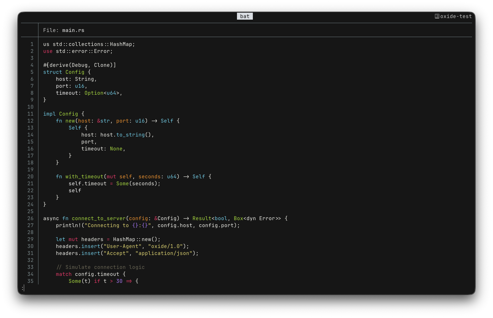

<div align="center">

# oxide for ghostty

</div>

<h6 align="center">
Where function meets form.
</h6>

<p align="center">
  <a href="https://github.com/oxidescheme/ghostty/stargazers"></a>
  <a href="https://github.com/oxidescheme/ghostty/issues"></a>
  <a href="https://discord.gg/p8GcbBH5MR"></a>
</p>

<p align="center">
  
</p>

**oxide** for [Ghostty](https://ghostty.org/) brings the oxide colorscheme to your terminal with OKLCH precision.
A minimalist dark theme built around clarity and restraint, using a deep near-black background, crisp white foregrounds, and vibrant accent colors to emphasize structure without visual noise.

## Design Philosophy

oxide is built on three core principles:

- **Function first**: Every color exists to convey information
- **Visual silence**: Elegance emerges from what is intentionally omitted
- **Systematic harmony**: Every color relates predictably to the others

The full design philosophy and color system are documented in the [main oxide repository](https://github.com/oxidescheme/oxide).

## Installation

### Built-in Theme (Recommended)

The simplest way to use oxide is with Ghostty's built-in theme support:

```toml
theme = oxide
```

### Manual Installation

To use the exact theme from this repository:

1. Download the `Oxide` file from this repository
2. Copy it to your Ghostty themes directory: `~/.config/ghostty/themes/`
3. Set the theme in your Ghostty configuration:

```toml
theme = Oxide
```

4. Reload or restart Ghostty

## Configuration

### Basic Usage

Add this line to your Ghostty configuration file (`~/.config/ghostty/config`):

```toml
theme = oxide
```

### Light/Dark Mode Support

oxide works great as a dedicated dark theme, or combined with a light theme:

```toml
theme = dark:oxide,light:your-light-theme
```

Ghostty will automatically switch based on your system appearance.

## Contributing

We follow the same philosophy as the main oxide project: minimalism doesn't mean stagnation.

- Report issues through [GitHub Issues](https://github.com/oxidescheme/ghostty/issues)
- PRs that improve clarity and consistency are welcome
- Ensure changes align with oxide's functional aesthetic

## Credits

- **Port Creator:** [@jakmaz](https://github.com/jakmaz)
- **Current Maintainer:** [@jakmaz](https://github.com/jakmaz)
- **Contributors:** See [contributors list](https://github.com/oxidescheme/ghostty/graphs/contributors)

## License

MIT License - see [LICENSE](LICENSE) for details.

<p align="center">
Copyright &copy; 2025-present oxidescheme
</p>
