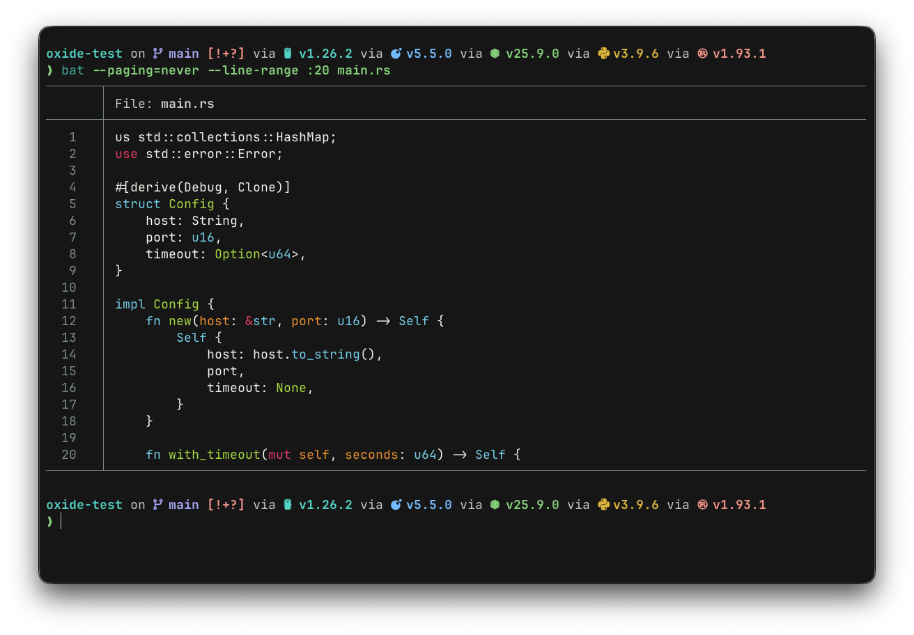

<div align="center">

# oxide for ghostty

</div>

<h6 align="center">
Where function meets form.
</h6>

<p align="center">
  <a href="https://github.com/oxidescheme/ghostty/stargazers"></a>
  <a href="https://github.com/oxidescheme/ghostty/issues"></a>
  <a href="https://discord.gg/p8GcbBH5MR"></a>
</p>

<p align="center">
  
</p>

**oxide** for [Ghostty](https://ghostty.org/).

## Installation

### Built-in Theme (Recommended)

The simplest way to use oxide is with Ghostty's built-in theme support:

```yaml
theme = oxide
```

### Manual Installation

To use the exact theme from this repository:

1. Download the `Oxide` file from this repository
2. Copy it to your Ghostty themes directory: `~/.config/ghostty/themes/`
3. Set the theme in your Ghostty configuration:

```yaml
theme = Oxide
```

4. Reload or restart Ghostty

## Configuration

Add this line to your Ghostty configuration file (`~/.config/ghostty/config`):

```yaml
theme = oxide
```

For automatic dark/light switching:

```yaml
theme = dark:oxide,light:your-light-theme
```

Ghostty will switch based on your system appearance.

## Contributing

PRs welcome. Make sure colors match the palette in the [main repo](https://github.com/oxidescheme/oxide).

## Credits

- **Port Creator:** [@jakmaz](https://github.com/jakmaz)
- **Current Maintainer:** [@jakmaz](https://github.com/jakmaz)
- **Contributors:** See [contributors list](https://github.com/oxidescheme/ghostty/graphs/contributors)

## License

MIT License - see [LICENSE](LICENSE) for details.

<p align="center">
Copyright &copy; 2025-present oxidescheme
</p>
